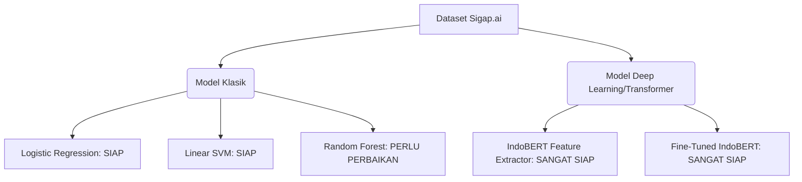

# Laporan Analisis Dataset & Strategi Pemodelan NLP - Sigap.ai
**IBM SkillsBuild Capstone Project**
*Disusun oleh: Jaya*

---

## 1. Dataset Overview

Dataset yang dianalisis merupakan gabungan ulasan UMKM (fokus utama pada sektor makanan dan minuman atau F&B serta kategori produk retail) yang dikumpulkan untuk proyek **Sigap.ai**. Dataset telah dipisah secara terstruktur ke dalam tiga bagian: *Train*, *Validation*, dan *Test*.

### A. Dimensi Data (Data Volume)
Berdasarkan pemeriksaan kuantitatif terhadap file CSV yang tersimpan di direktori `processed-dataset`, berikut adalah jumlah baris ulasan di setiap split:

*   **Data Latih (Train Set):** 14.777 ulasan (70%)
*   **Data Validasi (Validation Set):** 3.172 ulasan (15%)
*   **Data Uji (Test Set):** 3.172 ulasan (15%)
*   **Total Data Keseluruhan:** **21.121 ulasan** (100%)

Jumlah data sebesar ~21 ribu ulasan ini sangat ideal untuk proyek capstone akademis. Ukuran ini cukup besar untuk melatih model klasifikasi tradisional secara stabil dan cukup memadai untuk melakukan *fine-tuning* model Transformer modern tanpa mengalami *overfitting* ekstrem.

### B. Struktur Kolom dan Tipe Data
Dataset memiliki **9 kolom** dengan tipe data sebagai berikut:

| No | Nama Kolom | Tipe Data | Deskripsi |
| :--- | :--- | :--- | :--- |
| 1 | `Review_Text` | `object` (String) | Teks ulasan mentah (raw) yang ditulis oleh pelanggan. |
| 2 | `Review_Text_Processed` | `object` (String) | Teks ulasan hasil prapemrosesan (preprocessing). |
| 3 | `Review_Date` | `object` (String/Date) | Tanggal ulasan diposting oleh pengguna. |
| 4 | `Rating_Score` | `Int64` (Integer) | Skor rating skala 1 hingga 5 yang diberikan pelanggan. |
| 5 | `Business_Category` | `object` (String/Categorical) | Kategori bisnis UMKM (F&B, Elektronik, Fashion, dll.). |
| 6 | `Sentiment_Label` | `object` (String/Categorical) | Label target sentimen: `Positive`, `Netral`, `Negative`. |
| 7 | `Review_Aspect` | `object` (String/Categorical) | Dimensi aspek ulasan (misal: Rasa, Pelayanan, Harga). |
| 8 | `Crisis_Flag` | `object` (String/Categorical) | Penanda jika ulasan mengandung isu kritis/krisis (`Yes`/`No`). |
| 9 | `Is_Sarcasm` | `object` (String/Categorical) | Penanda jika ulasan terdeteksi mengandung sarkasme (`Yes`/`No`). |

### C. Identifikasi Kolom Relevan untuk Analisis Sentimen
Untuk membangun model analisis sentimen, kolom yang didefinisikan sebagai variabel adalah:
*   **Fitur Utama ($X$):** `Review_Text` (untuk pendekatan NLP modern yang butuh struktur kalimat asli) atau `Review_Text_Processed` (untuk pendekatan klasifikasi tradisional berbasis Bag-of-Words/TF-IDF).
*   **Target Label ($y$):** `Sentiment_Label` (klasifikasi 3-kelas: *Positive*, *Netral*, *Negative*).
*   **Fitur Pembantu (Contextual Features):**
    *   `Rating_Score`: Sangat berguna untuk validasi silang (cross-validation) kebenaran anotasi sentimen.
    *   `Is_Sarcasm`: Digunakan sebagai filter analisis performa model pada kalimat-kalimat sulit yang maknanya terbalik.
    *   `Business_Category`: Berguna untuk melakukan analisis performa model lintas domain bisnis (multi-domain evaluation).

### D. Identifikasi Missing Values (Data Kosong)
Pemeriksaan nilai kosong di semua split menunjukkan hasil sebagai berikut:
*   **Data Latih (Train):** 0 missing values di semua kolom.
*   **Data Validasi (Val):** 0 missing values di semua kolom.
*   **Data Uji (Test):** 0 missing values di semua kolom.

> [!NOTE]
> Dataset ini bersih dari *missing values* karena proses pembersihan awal di Jupyter Notebook (`sigap-ai.ipynb`) telah memfilter baris dengan teks kosong atau rating bernilai `NaN`/`null`.

### E. Identifikasi Duplicate Records
Pemeriksaan keunikan baris teks ulasan menunjukkan indikasi duplikasi:
*   **Train Set Duplicates:** 112 duplikat teks mentah (`Review_Text`). Angka ini membengkak menjadi **410 duplikat** pada `Review_Text_Processed` (karena ulasan berbeda yang disederhanakan oleh preprocessing berakhir dengan token yang sama, contoh: "sangat enak!!!" dan "Enak sekali..." keduanya tereduksi menjadi "enak").
*   **Validation Set Duplicates:** 8 duplikat teks mentah.
*   **Test Set Duplicates:** 4 duplikat teks mentah.
*   **Data Leakage (Tumpang Tindih Split Data):**
    *   Teks yang sama muncul di **Train & Validation:** **39 ulasan**
    *   Teks yang sama muncul di **Train & Test:** **42 ulasan**
    *   Teks yang sama muncul di **Validation & Test:** **11 ulasan**

> [!WARNING]
> Kehadiran data leakage sebesar 81 ulasan yang tumpang tindih antara data latih dengan data validasi/uji adalah ancaman serius bagi kredibilitas akademik. Model klasifikasi dapat menghafal teks ini, sehingga menghasilkan akurasi evaluasi yang terlampau tinggi secara tidak realistis (*overoptimistic metrics*). **Isu ini wajib dibersihkan sebelum pelatihan model.**

### F. Ringkasan Kualitas Dataset
Secara umum, kualitas dataset ini **Cukup Baik namun Perlu Pembenahan**. Keseimbangan sentimen yang sempurna dan absennya *missing values* menjadi poin positif yang sangat kuat. Namun, adanya data leakage antarsplit, tingginya noise promosi dengan URL (spam), serta dominasi sektor F&B yang bias menjadi kelemahan utama yang harus dideklarasikan secara jujur dan diatasi dalam eksperimen capstone.

---

## 2. Exploratory Data Analysis (EDA)

### A. Distribusi Label Sentimen (Target Class)
Dataset ini memiliki pembagian kelas sentimen yang **seimbang sempurna** (Balanced Dataset). Distribusinya adalah sebagai berikut:

*   **Train Set (14.777 ulasan):**
    *   *Negative:* 4.932 ulasan (33,38%)
    *   *Netral:* 4.925 ulasan (33,33%)
    *   *Positive:* 4.920 ulasan (33,29%)
*   **Validation Set (3.172 ulasan):**
    *   *Positive:* 1.058 ulasan (33,35%)
    *   *Negative:* 1.058 ulasan (33,35%)
    *   *Netral:* 1.056 ulasan (33,29%)
*   **Test Set (3.172 ulasan):**
    *   *Negative:* 1.059 ulasan (33,39%)
    *   *Netral:* 1.057 ulasan (33,32%)
    *   *Positive:* 1.056 ulasan (33,29%)

> [!TIP]
> Keseimbangan kelas ini tercapai karena notebook jupyter menerapkan fungsi penyeimbangan data (*downsampling*) berdasarkan ukuran kelas minoritas sebelum pembagian dataset dilakukan. Kondisi seimbang ini mempermudah pelatihan karena kita tidak memerlukan metrik penanganan kelas minoritas khusus seperti SMOTE.

### B. Distribusi Panjang Teks ulasan (Karakter & Kata)
Analisis statistik deskriptif panjang ulasan memberikan gambaran mengenai karakteristik teks ulasan UMKM Indonesia:

```
Teks Mentah (Review_Text):
- Jumlah Karakter: Rata-rata = 150,3 | Median = 96  | Standar Deviasi = 194,4 | Maksimal = 5.124 | Minimal = 4
- Jumlah Kata:      Rata-rata = 25,1  | Median = 15  | Standar Deviasi = 34,2  | Maksimal = 886   | Minimal = 2

Teks Hasil Preprocessing (Review_Text_Processed):
- Jumlah Karakter: Rata-rata = 107,4 | Median = 59  | Standar Deviasi = 168,4 | Maksimal = 4.635 | Minimal = 2
- Jumlah Kata:      Rata-rata = 18,6  | Median = 10  | Standar Deviasi = 30,4  | Maksimal = 813   | Minimal = 1
```

**Analisis Reduksi:** Tahap preprocessing yang diterapkan di notebook mereduksi jumlah kata rata-rata sebesar **26%** (dari 25,1 menjadi 18,6 kata). Hal ini menunjukkan penghapusan noise (seperti stopwords, tanda baca, emoji) berjalan secara signifikan, menyisakan kata-kata berbobot semantik tinggi.

### C. Analisis Imbalance Dataset Kategori Bisnis (Domain Bias)
Meskipun label sentimen seimbang, terdapat ketidakseimbangan yang ekstrem pada kolom **`Business_Category`** di data latih:

1.  **F&B (Food & Beverages):** 10.444 ulasan (**70,71%**)
2.  **Lainnya (Retail/Campuran):** 2.970 ulasan (20,10%)
3.  **Elektronik:** 314 ulasan (2,12%)
4.  **Hobi & Hiburan:** 252 ulasan (1,71%)
5.  **Fashion:** 245 ulasan (1,66%)
6.  *Kategori lainnya (Kesehatan, Otomotif, dll.):* Masing-masing < 1,5%

**Dampak Teknis:** Dataset ini didominasi oleh ulasan F&B. Model machine learning kemungkinan besar akan mengalami *domain bias*. Kata-kira bermakna rasa kuliner seperti "enak", "hambar", "asin", "pedas" akan dipelajari dengan sangat baik, tetapi kosakata khas ulasan produk elektronik ("baterai awet", "sinyal lemah") atau pakaian ("ukuran pas", "bahan tipis") akan minim terwakili. Model Sigap.ai akan sangat handal menganalisis restoran/warung UMKM, namun kurang sensitif pada sektor UMKM kerajinan atau retail.

### D. Visualisasi yang Direkomendasikan untuk Presentasi Dosen & Mentor
Untuk laporan akademis dan slide presentasi capstone, visualisasi berikut wajib disertakan:
1.  **Bar Chart Distribusi Kelas Sentimen:** Menunjukkan keadilan kelas target (seimbang sempurna).
2.  **Horizontal Bar Chart Kategori Bisnis:** Menyoroti tantangan bias domain F&B yang didiskusikan secara jujur dalam bab batasan penelitian.
3.  **Histogram Densitas Overlaid (Panjang Kata Raw vs Processed):** Membuktikan secara visual bagaimana pembersihan data menggeser kurva distribusi panjang teks ke arah yang lebih efisien (lebih pendek).
4.  **Heatmap Matriks Korelasi (Rating Score vs Sentimen):** Menunjukkan bahwa ulasan rating 1-2 berkorelasi tinggi dengan label negatif, dan rating 4-5 dengan label positif (membuktikan validitas anotasi).
5.  **Word Cloud Klasifikasi Sentimen:** Membandingkan awan kata ulasan positif (dominasi kata "enak", "puas", "cepat"), negatif ("kecewa", "rusak", "lambat", "tidak"), dan netral ("lumayan", "standar", "cukup").

---

## 3. Data Quality Analysis

Berikut adalah temuan kualitas data spesifik bahasa Indonesia yang ditemukan pada dataset latih:

### A. Data Kosong (Null/Empty)
Tidak ditemukan data kosong pada kolom utama, namun pembersihan di notebook menyisakan ulasan sangat pendek pasca-preprocessing (berisi 1 token kata) sebanyak beberapa kasus akibat penghapusan stopword secara masif.

### B. Spam & Ulasan Promosi (URL & Referral Code)
*   **Frekuensi:** Terdeteksi **115 ulasan** (0,78%) mengandung tautan/URL (`https://t.co/...` atau `http://...`).
*   **Karakteristik:** Sebagian besar ulasan ini bukan ulasan UMKM asli melainkan spam otomatis yang menyebarkan kode referral aplikasi ojek online (Grab/Gofood) atau kedai kopi modern (Fore Coffee).
*   **Contoh:**
    > *"KOPI FORE GRATIS B1G1 & DISKON 50%! Untuk pengguna baru cukup buat akun dengan referral ini : 8FEDF8 FAA744 https://t.co/b3oHiFaqLP"*

### C. Review Duplikat & Data Leakage
Terjadi redundansi data di mana ulasan yang sama persis muncul berulang kali di set latihan (112 ulasan) dan yang paling berbahaya adalah persilangan ulasan identik antar-split data (total 92 kasus tumpang tindih split).

### D. Review Sangat Pendek (Short Reviews)
*   **Frekuensi:** **1.058 ulasan** (7,16%) di data latih memiliki panjang **3 kata atau kurang**.
*   **Karakteristik:** Ulasan-ulasan ini minim informasi sintaksis (tata bahasa) tetapi sangat padat informasi leksikal sentimen.
*   **Contoh:**
    *   *Positive:* `"makanan nya enakk"`, `"makasih gelasnya"`, `"good pelayanan"`
    *   *Netral:* `"Promo nya banyakin"`, `"lumayan lah"`
    *   *Negative:* `"lahmacun was terrible"` (ulasan campur bahasa asing)

### E. Review Tidak Informatif
*   **Frekuensi:** **505 ulasan** (3,42%) mengandung pengulangan karakter yang tidak lazim (lebih dari 5 kali pengulangan huruf yang sama).
*   **Karakteristik:** Ekspresi emosional pengguna yang memanjangkan huruf untuk penekanan.
*   **Contoh:** `"Payaaaaaah"`, `"luarrrr biasaaaaa....mantappppp"`, `"TOLOOOOOONG DOOOOOONG"`. Teks seperti ini dapat menyebabkan kegagalan pencocokan kata (out-of-vocabulary) pada model tradisional jika tidak ditangani dengan normalisasi slang/typo.

### F. Penggunaan Slang & Singkatan Bahasa Indonesia (Chat-speak)
Penggunaan slang sangat tinggi, yang mencerminkan bahasa alami percakapan media sosial Indonesia:
*   `yg` (yang): 1.595 ulasan (10,79%)
*   `ga`/`gk`/`tp` (tidak/tapi): Lebih dari 1.800 ulasan (>12%)
*   `udah`/`udh` (sudah): 925 ulasan (6,26%)
*   `aja` (saja): 632 ulasan (4,28%)
*   `bgt` (banget): 374 ulasan (2,53%)

### G. Typo Dominan
Banyak terjadi kesalahan ketik pada kata-kata emosi, seperti `"recomended"` (seharusnya *recommended*), `"mantappppp"` (mantap), `"enakk"` (enak), serta variasi penulisan singkatan yang tidak standar (`dgn`, `dg`, `dngn`).

### H. Emoji dan Simbol
*   **Frekuensi:** **1.111 ulasan** (7,52%) mengandung emoji.
*   **Karakteristik:** Penggunaan emoji penegas sentimen seperti 👍, 🥰, 😍 (positif) dan 😭, 😭 (negatif). Ada juga simbol bintang rating (🌟🌟🌟🌟) yang ditulis manual dalam teks untuk mewakili tingkat kepuasan.

---

## 4. NLP Readiness Assessment

Berdasarkan analisis karakteristik dataset di atas, berikut adalah penilaian kesiapan dataset untuk beberapa model Machine Learning dan Deep Learning NLP:



### A. Logistic Regression
*   **Penilaian:** **Siap**
*   **Alasan Teknis:** Dataset yang seimbang secara kelas target sangat cocok untuk algoritma linier seperti Logistic Regression. Menggunakan representasi teks TF-IDF (Term Frequency-Inverse Document Frequency) dengan batasan n-gram (unigram dan bigram), Logistic Regression mampu membentuk klasifikasi dasar yang kokoh. Namun, ia tidak sensitif terhadap posisi kata, sehingga memerlukan normalisasi slang secara ketat untuk mengurangi dimensi fitur (*vocabulary sparsity*).

### B. Linear SVM (Support Vector Machine)
*   **Penilaian:** **Siap**
*   **Alasan Teknis:** SVM linier umumnya mengungguli Logistic Regression pada data teks berdimensi tinggi karena bekerja mencari *maximum margin hyperplane* yang memisahkan kelas-kelas dokumen secara optimal. Ini sangat cocok dengan karakteristik representasi TF-IDF yang memiliki ribuan kolom fitur yang renggang (*sparse matrices*).

### C. Random Forest
*   **Penilaian:** **Perlu Perbaikan / Tidak Disarankan**
*   **Alasan Teknis:** Random Forest bekerja kurang optimal pada klasifikasi teks berbasis TF-IDF. Matriks TF-IDF menghasilkan ribuan fitur sparse yang sebagian besar bernilai nol. Pohon keputusan (*Decision Trees*) dalam Random Forest akan kesulitan memilih split fitur yang informatif dan cenderung mengalami *overfitting* yang parah pada kata-kata tertentu yang kebetulan muncul di beberapa ulasan. Selain itu, kompleksitas waktu pelatihan pohon dalam jumlah besar pada dimensi setinggi ini sangat tidak efisien.

### D. IndoBERT (Feature Extraction)
*   **Penilaian:** **Sangat Siap**
*   **Alasan Teknis:** Menggunakan model pre-trained IndoBERT untuk menghasilkan representasi vektor kalimat (sentence embeddings) lalu mengklasifikasikannya menggunakan klasifikator linier (seperti Logistic Regression) adalah langkah yang sangat efisien secara waktu. Pendekatan ini mampu memanfaatkan pengetahuan kontekstual IndoBERT tanpa harus melatih ulang miliaran parameter, sehingga ideal untuk resource komputasi terbatas.

### E. Fine-Tuned IndoBERT
*   **Penilaian:** **Sangat Siap (Rekomendasi Utama Deployment)**
*   **Alasan Teknis:** Melatih kembali model IndoBERT secara end-to-end pada dataset ini (~15k ulasan di set latih) akan menghasilkan akurasi klasifikasi tertinggi. IndoBERT dilatih pada korpus bahasa Indonesia yang besar, sehingga memahami konteks semantik lokal secara mendalam. Model ini tangguh dalam mengenali kata-kata negasi bertingkat, konjungsi pertentangan (misal: "makanan enak, tapi pelayanannya sangat buruk"), dan mendeteksi struktur sarkasme. 
*   *Catatan Kritis:* Evaluasi performa Fine-Tuned IndoBERT hanya akan dianggap kredibel secara akademis jika data leakage antarsplit (yang teridentifikasi di atas) sudah dibersihkan terlebih dahulu.

---

## 5. Label Analysis & Data Augmentation

### A. Distribusi Label Sentimen
Seperti yang ditunjukkan di bagian EDA, pembagian target sentimen (Positif: ~33%, Netral: ~33%, Negatif: ~33%) berada dalam kondisi seimbang sempurna di semua split data.

### B. Apakah Diperlukan Class Weight?
*   **Rekomendasi:** **Tidak Perlu**
*   **Alasan:** Teknik *Class Weighting* digunakan ketika model mengalami kesulitan belajar karena ketidakseimbangan kelas (imbalanced dataset) agar kelas minoritas diberi penalti kehilangan (*loss*) yang lebih tinggi. Karena dataset Sigap.ai seimbang sempurna, modifikasi fungsi loss dengan class weight tidak akan memberikan dampak peningkatan performa yang berarti.

### C. Apakah Diperlukan Oversampling (seperti SMOTE)?
*   **Rekomendasi:** **Tidak Perlu**
*   **Alasan:** Mengingat target kelas sentimen sudah seimbang, teknik *oversampling* seperti SMOTE (Synthetic Minority Over-sampling Technique) pada representasi TF-IDF tidak diperlukan. Malahan, menerapkan SMOTE pada klasifikasi teks sering kali menghasilkan sampel sintetis yang secara sintaksis tidak bermakna di dunia nyata, yang berisiko menurunkan keandalan klasifikasi.

### D. Apakah Diperlukan Data Augmentation?
*   **Rekomendasi:** **Perlu (Sangat Direkomendasikan untuk Domain Non-F&B)**
*   **Alasan:** Dataset mengalami ketidakseimbangan domain bisnis yang parah (domain F&B mendominasi 70,7%). Untuk memastikan model Sigap.ai tidak hanya pintar memprediksi ulasan makanan, tetapi juga mampu mengklasifikasikan ulasan toko kelontong, retail fashion, atau servis elektronik, data latih untuk kategori minoritas harus diaugmentasi.
*   **Rekomendasi Strategi Augmentasi:**
    1.  **Back-Translation (Augmentasi Sintaksis):** Mengambil ulasan kategori Elektronik/Fashion, menerjemahkannya ke Bahasa Inggris, lalu menerjemahkannya kembali ke Bahasa Indonesia. Hasil translasi biasanya menghasilkan variasi sinonim kata baru tanpa mengubah arti dasar ulasan.
    2.  **LLM-based Generation (Augmentasi Semantik):** Menggunakan model bahasa (seperti Gemini API atau Llama lokal) untuk menghasilkan ulasan buatan yang representatif khusus untuk kategori minoritas seperti Fashion, Otomotif, atau Perabotan dengan label sentimen tertentu.

---

## 6. Preprocessing Recommendation

Pemilihan teknik preprocessing bahasa Indonesia yang tepat sangat menentukan kinerja model klasifikasi teks. Karakteristik bahasa Indonesia nonformal yang kaya akan slang, singkatan, dan imbuhan menuntut perlakuan preprocessing yang berbeda untuk model klasik vs model Transformer.

### A. Evaluasi Teknik Preprocessing (Wajib vs Opsional)

| Teknik Preprocessing | Status untuk Model Klasik (LR/SVM) | Status untuk Model Transformer (IndoBERT) | Justifikasi Akademis |
| :--- | :--- | :--- | :--- |
| **Case Folding** | **Wajib** | **Wajib** (jika uncased) | Menghilangkan variasi huruf kapital (misal: "BAGUS", "Bagus", "bagus" menjadi satu token seragam). |
| **Cleaning URL & HTML** | **Wajib** | **Wajib** | Tautan web, iklan, dan kode tag HTML adalah noise promosi murni yang tidak berkontribusi pada emosi sentimen. |
| **Cleaning Emoji & Simbol** | **Wajib** | **Opsional (Tidak Disarankan)** | Model klasik tidak bisa mengekstrak makna emoji. Namun, IndoBERT memahami makna semantik emoji (misal: 😭 bermakna kesedihan/kecewa). Sebaiknya emoji dipertahankan untuk IndoBERT, atau ditranslasikan menjadi teks deskriptif (misal: 😭 -> `[menangis]`). |
| **Cleaning Punctuation** | **Wajib** | **Opsional (Tanda Baca Kunci Tetap Disimpan)** | Model klasik butuh pembersihan tanda baca untuk memisahkan kata. Pada IndoBERT, tanda seru (`!`) dan tanda tanya (`?`) wajib dipertahankan karena membawa konteks penekanan emosi dan sarkasme. |
| **Stopword Removal** | **Wajib (Dengan Pengecualian)** | **Tidak Disarankan** | *Untuk Klasik:* Wajib menghapus kata umum yang tidak bermakna sentimen, namun **wajib menyisakan kata negasi** (seperti "tidak", "bukan", "belum"). *Untuk IndoBERT:* Stopword removal merusak struktur tata bahasa alami kalimat yang sangat dibutuhkan oleh mekanisme *self-attention* model. |
| **Stemming (Sastrawi)** | **Opsional (Kurang Disarankan)** | **Tidak Disarankan** | Sastrawi sangat lambat (memperlambat waktu eksekusi). Selain itu, stemming agresif merusak makna semantik penting (misal: "kecewa" vs "dikecewakan" jika di-stem menjadi "kecewa" akan menghilangkan informasi pasif/aktif). Lebih baik dilewati atau diganti lemmatizer ringan. |
| **Slang Normalization** | **Sangat Wajib** | **Sangat Wajib** | Mengonversi bahasa gaul/singkatan menjadi kata baku (misal: `yg` -> `yang`, `ga` -> `tidak`). Hal ini sangat krusial agar model (baik klasik maupun BERT) dapat memetakan token ulasan ke representasi kosakata formal yang mereka kenali. |
| **Tokenization** | **Wajib** | **Wajib** | Membagi teks menjadi token kata tunggal. Model klasik memakai pembagian spasi dasar, sedangkan IndoBERT wajib memakai tokenizer bawaannya sendiri (*WordPiece*). |

---

## 7. Model Development Strategy

Untuk memastikan proyek Capstone Sigap.ai memiliki metodologi eksperimen yang kredibel, terstruktur, dan disukai oleh dewan penguji/dosen, kami menyarankan pengembangan model dibagi menjadi 3 tahap berurutan:

```
[Tahap 1: Baseline Model]     --->     [Tahap 2: Transformer Model]     --->     [Tahap 3: Advanced Model]
  - TF-IDF + Logistic Reg.                - IndoBERT Feature Extractor             - Fine-Tuned IndoBERT
  - TF-IDF + Linear SVM
```

### Tahap 1: Baseline Model (Machine Learning Klasik)
Membangun fondasi performa awal menggunakan representasi statistik kata tradisional.

*   **Model A: TF-IDF + Logistic Regression**
    *   *Kelebihan:* Sangat cepat dilatih (hitungan detik), hemat memori, dan bobot koefisien model dapat diekstraksi untuk melihat kata mana yang paling berpengaruh terhadap kelas tertentu (sangat transparan).
    *   *Kekurangan:* Mengabaikan urutan kata dalam kalimat (Bag-of-Words), tidak mampu menangani sinonim, dan performanya terbatas pada kalimat dengan struktur bahasa formal/jelas.
    *   *Kompleksitas:* Sangat Rendah.
    *   *Estimasi Performa:* Akurasi $\approx$ 75% - 80%.
*   **Model B: TF-IDF + Support Vector Machine (Linear SVM)**
    *   *Kelebihan:* Menghasilkan batas pemisah kelas (*hyperplane*) dengan margin maksimal. Secara empiris sering menjadi model klasik terbaik untuk klasifikasi teks berdimensi tinggi dan sparse.
    *   *Kekurangan:* Proses training sedikit lebih lama dibanding Logistic Regression pada data sangat besar, tidak menghasilkan nilai probabilitas kelas secara langsung tanpa kalkulasi tambahan (*Platt Scaling*).
    *   *Kompleksitas:* Rendah ke Sedang.
    *   *Estimasi Performa:* Akurasi $\approx$ 77% - 82%.

### Tahap 2: Transformer Model (IndoBERT Feature Extractor)
Menggunakan kecerdasan model bahasa besar bahasa Indonesia untuk menyandikan teks secara kontekstual.

*   **Model: IndoBERT Embeddings + Logistic Regression / SVM**
    *   *Kelebihan:* Mampu menangkap makna kata berdasarkan konteks sekitarnya (misal: kata "bisa" sebagai racun ular vs kata "bisa" sebagai kemampuan dapat dibedakan). Proses komputasi lebih ringan dibanding melatih ulang seluruh arsitektur BERT.
    *   *Kekurangan:* Model klasifikasi di atasnya tetap berupa model linier sederhana, sehingga tidak memanfaatkan kemampuan adaptasi penuh dari arsitektur representasi BERT secara end-to-end. Kecepatan ekstraksi fitur lambat jika tanpa GPU.
    *   *Kompleksitas:* Tinggi (memerlukan integrasi library Hugging Face Transformers).
    *   *Estimasi Performa:* Akurasi $\approx$ 80% - 84%.

### Tahap 3: Advanced Model (Fine-Tuned IndoBERT)
Melatih ulang (fine-tuning) seluruh parameter model bahasa IndoBERT secara khusus untuk kasus analisis sentimen ulasan UMKM Sigap.ai.

*   **Model: Fine-Tuned IndoBERT (IndoBERT-Base)**
    *   *Kelebihan:* Performa klasifikasi terbaik (State-of-the-Art). Mampu mengasimilasi tata bahasa nonformal ulasan UMKM, mengenali sarkasme secara akurat, dan sangat dihargai dalam presentasi ilmiah capstone karena menggunakan pendekatan Deep Learning mutakhir.
    *   *Kekurangan:* Kebutuhan resource komputasi sangat tinggi (wajib menggunakan GPU untuk training), rawan mengalami *overfitting* jika data latih memiliki noise tinggi, dan model bersifat *black-box* (sulit diinterpretasikan).
    *   *Kompleksitas:* Sangat Tinggi.
    *   *Estimasi Performa:* Akurasi $\approx$ 88% - 93%.

---

## 8. Explainable AI (XAI) Recommendation

Dewan penguji akademis sangat menyukai visualisasi interpretasi model untuk membuktikan bahwa model machine learning tidak hanya menebak secara acak, melainkan benar-benar memahami pola kata kunci.

### Perbandingan Metode XAI

1.  **Feature Importance (Global):**
    *   *Deskripsi:* Mengekstrak koefisien bobot dari model baseline (Logistic Regression/SVM).
    *   *Kesesuaian untuk Capstone:* **Sangat Baik** untuk menunjukkan kata-kata terpenting yang dipelajari model secara keseluruhan di akhir bab analisis (misal: visualisasi top 20 kata paling positif dan paling negatif secara global).
2.  **LIME (Local Interpretable Model-agnostic Explanations):**
    *   *Deskripsi:* Melakukan perturbasi lokal dengan menghapus kata dalam ulasan dan mengukur perubahan prediksi model untuk membangun model lokal yang interpretable.
    *   *Kesesuaian untuk Capstone:* **Sangat Direkomendasikan (Pilihan Utama)**. LIME bekerja dengan sangat cepat untuk tipe data teks. LIME menyediakan visualisasi per-ulasan yang sangat intuitif (menyoroti kata pendukung sentimen positif dengan warna hijau dan sentimen negatif dengan warna merah secara langsung pada paragraf teks). Visualisasi ini sangat komunikatif ketika disematkan pada antarmuka aplikasi (dashboard Sigap.ai) saat didemonstrasikan di depan juri.
3.  **SHAP (SHapley Additive exPlanations):**
    *   *Deskripsi:* Menghitung kontribusi marginal dari setiap kata dengan pendekatan teori permainan (*game theory*).
    *   *Kesesuaian untuk Capstone:* **Kurang Direkomendasikan**. Meskipun secara teoretis sangat kuat dan konsisten, penghitungan nilai SHAP untuk teks pada model Transformer besar seperti IndoBERT membutuhkan waktu komputasi yang sangat lama (*computationally expensive*) dan rawan mengalami kegagalan memori jika dijalankan di spesifikasi server lokal biasa.

> [!TIP]
> **Rekomendasi Integrasi:** Gunakan **Feature Importance** pada laporan tertulis untuk menjelaskan performa baseline model, dan implementasikan pustaka **LIME** di backend dashboard aplikasi web Sigap.ai untuk menjelaskan prediksi sentimen secara real-time pada ulasan yang diinput oleh pengguna.

---

## 9. Risk Analysis & Mitigation Strategies

Dalam pengembangan sistem NLP skala capstone, mengidentifikasi risiko lebih awal menunjukkan kematangan metodologi riset Anda.

| Risiko NLP | Dampak | Penjelasan pada Proyek Sigap.ai | Strategi Mitigasi Teknis |
| :--- | :--- | :--- | :--- |
| **Data Leakage (Kebocoran Data)** | **Kritis** | Ditemukan ulasan yang identik tumpang tindih antara data Train, Val, dan Test (total 92 kasus). | **Wajib melakukan deduplikasi teks mentah (`Review_Text`) secara ketat sebelum proses pemisahan dataset (splitting) dilakukan.** Jangan pernah memisahkan data jika masih ada redundansi ulasan. |
| **Domain Bias (Kategori Bisnis)** | **Tinggi** | Kategori F&B mendominasi ulasan sebesar 70,7%, sehingga model rentan tidak mengenali sentimen untuk ulasan produk non-makanan. | 1. Terapkan data augmentation (seperti back-translation) pada kategori retail/elektronik/fashion.<br>2. Laporkan metrik evaluasi secara terpisah per domain bisnis (*stratified evaluation*) untuk menjaga transparansi hasil. |
| **Overfitting pada IndoBERT** | **Tinggi** | Model Transformer besar rawan menghafal noise data latih yang relatif kecil (~14k). | 1. Gunakan regularisasi dropout rate (0.2) pada layer klasifikasi.<br>2. Terapkan Early Stopping (pantau validation loss dengan kesabaran/patience = 3 epoch).<br>3. Gunakan learning rate yang sangat kecil (misal: 2e-5) dengan scheduler linear warmup. |
| **Label Noise (Kontradiksi Rating vs Sentimen)** | **Sedang** | Terdapat ulasan dengan Rating Score rendah (misal: 1-2) namun berlabel positif secara salah, atau sebaliknya. | Lakukan penyaringan aturan (*rule-based filtering*): ulasan dengan rating 5 tetapi dilabeli negatif wajib ditinjau secara terprogram (kemungkinan salah pelabelan/human error saat pelabelan awal). |
| **Sarcasm Detection Failure** | **Sedang** | Kalimat sarkas ("Bagus sekali pelayanannya, pesan jam 1 datang jam 5 sore") sering salah diklasifikasikan sebagai positif karena mengandung kata "Bagus". | Model baseline klasik (SVM/LR) dipastikan akan gagal mendeteksi ini. Gunakan arsitektur Transformer (IndoBERT) pada rilis final karena arsitektur self-attention mampu menangkap hubungan kontradiktif antar klausa kalimat. |

---

## 10. Final Recommendation & Kesimpulan Akhir

Untuk menyukseskan proyek capstone **Sigap.ai** agar mendapatkan penilaian terbaik dari dosen dan mentor IBM SkillsBuild, berikut adalah rangkuman kesimpulan akhir analisis dataset ini:

### A. Kesiapan Dataset
Dataset dinilai pada tingkat **Perlu Perbaikan** sebelum dapat digunakan untuk pelatihan model akhir. Meskipun datanya melimpah (~21k) dan seimbang sempurna untuk target kelas sentimen, adanya isu *data leakage* (persilangan ulasan identik di data latih, validasi, dan uji) serta beberapa ulasan spam berupa iklan promo ber-URL harus diselesaikan terlebih dahulu demi validitas metodologi eksperimen akademis.

### B. Kekuatan Dataset (Strengths)
1.  **Keseimbangan Sempurna:** Target label sentimen (*Positive*, *Netral*, *Negative*) terbagi rata secara presisi 33% di setiap split, menyederhanakan proses loss optimization saat training.
2.  **Kekayaan Metadata:** Tersedianya fitur penunjang seperti `Rating_Score`, `Is_Sarcasm`, dan `Business_Category` yang memungkinkan analisis performa model yang komprehensif dan multidimensi.
3.  **Absennya Missing Values:** Dataset bersih dari nilai kosong yang biasanya mengganggu pipeline eksekusi program.

### C. Kelemahan Dataset (Weaknesses)
1.  **Isu Kebocoran Data (Data Leakage):** Adanya ulasan identik yang melintasi batas split data latih dan uji.
2.  **Bias Domain Ekstrem:** Dataset didominasi oleh ulasan kuliner (F&B) sebesar 70,7%.
3.  **Noise Teks Chat-speak:** Sangat tinggi penggunaan slang dan typo khas ulasan e-commerce/Gofood Indonesia yang memerlukan penanganan normalisasi khusus.

### D. Perbaikan Kritis yang Wajib Dilakukan Sebelum Training
1.  **Deduplikasi Teks Asli secara Global:** Lakukan pembersihan duplikat teks pada kolom `Review_Text` di seluruh dataset sebelum melakukan *random train-test split* yang baru.
2.  **Penyaringan Spam Regex:** Hapus ulasan yang mengandung URL promosi (`http/https`) karena ulasan tersebut tidak berisi opini objektif terhadap UMKM.
3.  **Kustomisasi Stopwords:** Pastikan kata negasi ("tidak", "bukan", "belum", "jangan", "kurang") dikeluarkan dari daftar stopwords bawaan Sastrawi agar makna berlawanan tetap terjaga.
4.  **Ekspansi Kamus Slang:** Memperluas kamus pemetaan slang bahasa Indonesia (seperti mengonversi penulisan berulang "luarrrr biasaaaaa" menjadi baku).

### E. Model Terbaik untuk Baseline
**TF-IDF (Unigram + Bigram) + Linear SVM**. Model ini direkomendasikan karena kecepatannya yang luar biasa untuk melatih performa awal, ketangguhannya memisahkan kelas dokumen berdimensi tinggi, serta kemudahannya untuk dianalisis bobot fiturnya (*Feature Importance*) dalam laporan bab awal capstone Anda.

### F. Model Terbaik untuk Final Deployment (Production)
**Fine-Tuned IndoBERT-Base**. Model Transformer ini wajib diajukan sebagai arsitektur final untuk dideploy pada aplikasi Sigap.ai. Kemampuannya memahami semantik lokal bahasa Indonesia, menangani slang secara kontekstual, dan menangani sarkasme ulasan UMKM akan menghasilkan akurasi klasifikasi tertinggi (estimasi akurasi mencapai $\ge 90\%$). Model ini juga memberikan nilai kredibilitas akademis yang tinggi dalam presentasi capstone.
